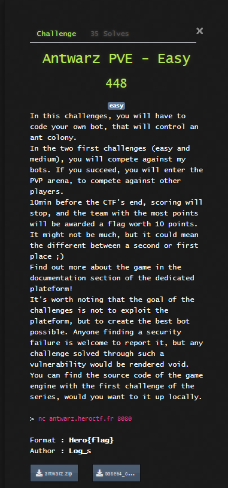
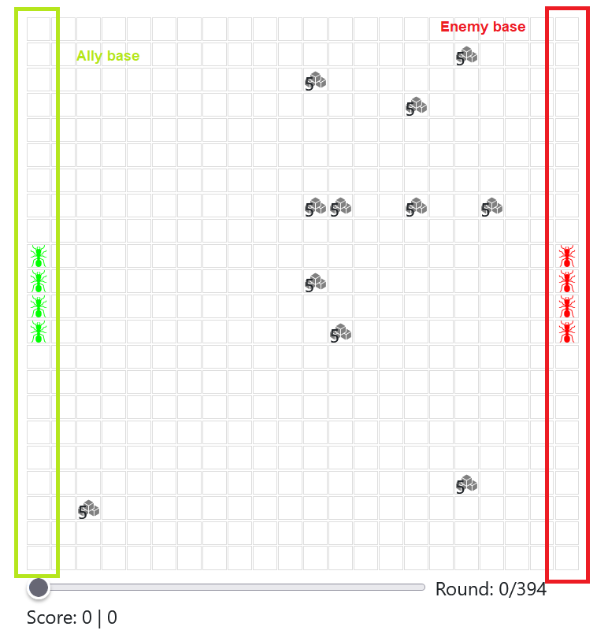

# Prog - Antwarz





## Overview

The goal of this challenge is to create a bot that leads an ant army. This bot needs to lead his ants in order to collect more sugar than the enemy. To win the game, you need to collect more sugar than the enemy, without doing any illegal move.


A documentation was provided, you can find it [here](doc.pdf).

In order to control the bot, the python script need to define a function, called `make_move(game_state)`, that takes a parameter descibing the current game state.




The main point of this game is to discover sugar, collect it, and take it back to the base, in a faster way than the enemy.

The size of the grid can vary from 8x8 to 24x24 and the number of ants you start with is random.

Each turn, the main function is called with a dictionnary containing all data necessary.

```json
{
    "your_ants": [
        {
            "pos": (1, 1),
            "last_pos": (1, 0),
            "carrying": False,
            "last_carrying": False

        },
        {
            "pos": (1, 0),
            "last_pos": (1, 0),
            "carrying": True
            "last_carrying": False
        }
    ],
    "opponent_ants": [
        {
            "pos": (5, 3),
            "last_pos": (5, 3),
            "carrying": False
            "last_carrying": False

        }
    ],
    "discovered_cubes": [
        {
            "pos": (1, 0),
            "sugar": 5
        } 
    ],
    "total_sugar_available": 68,
    "grid_size": 16,
    "your_score": 7,
    "opponent_score": 9,
    "ant_cost": 2,
    "player_data": b"AAAAAAAAAAAA"
}
```


## Aproach to solve this game

To solve this problem, I decided to code my bot a spicic way.

```
 - if you are on a sugar and you dont carry one -> take it
 - if you carry sugar -> go back to base
 - if you are next to sugar (2 blocks) -> go to it
 - if there is non empty sugar pile that we discoverd -> go to the first one
 - else -> go to a random direction
```

To avoid making illegal moves, I added a second part to my function that would bloc them.

```
 - if you are going outside of board -> do nothing
 - if you are ending in the same block than another ant -> try to change the direction, with a priority for carriers
 - if this loop changed something -> run another time to see if there is no other illegal mooves
```

This algorythm gave a big python script.

```py
def make_move(game_state):
    
    my_ants = []
    
    # gen la sequence random
    if game_state["player_data"] == b"":
        game_state["player_data"] = b"342"
    
    
    # clean pour dégager le sucres vides si il y en a
    sugars_modified = []
    for s in game_state["discovered_cubes"]:
        if s["sugar"] != 0:
            sugars_modified.append(s)
    
    game_state["discovered_cubes"] = sugars_modified
        
    
    
    for ant in game_state["your_ants"]:
        actual_ant = {}
        
        #  --- calcul pour plus tard --- 
        ant_on_sugar = False
        for sugar in game_state["discovered_cubes"]:
            if ant["pos"] == sugar["pos"]:
                ant_on_sugar = True
        
        ant_next_to_sugar = ()
        for sugar in game_state["discovered_cubes"]:
            # on considere que next to = 2 cubes
            if (abs(ant["pos"][0] - sugar["pos"][0]) <= 2) and (abs(ant["pos"][1] - sugar["pos"][1]) <= 2):
                ant_next_to_sugar = sugar["pos"]
        
        # si on a du sugar sur sois
        if ant["carrying"]:
            # on le dépose
            if ant["pos"][0] == 0:
                actual_ant = {
                    "pos" : ant["pos"],
                    "carrying": False,
                    "move": "stay"
                }
            # ou on rentre a la base en ligne droite
            else:
                actual_ant = {
                    "pos" : ant["pos"],
                    "carrying": True,
                    "move": "left"
                }
                
        # si on est sur un sugar, on le récup
        elif ant_on_sugar:
            actual_ant = {
                    "pos" : ant["pos"],
                    "carrying": True,
                    "move": "stay"
                }
        
        # si on a du sugar pas loin
        elif ant_next_to_sugar != ():
            # si on doit bouger en y
            if ant["pos"][0] != ant_next_to_sugar[0]:
                if ant["pos"][0] >= ant_next_to_sugar[0]:
                    move = "left"
                else:
                    move = "right"
            # si on doit bouger en x
            else:
                if ant["pos"][1] >= ant_next_to_sugar[1]:
                    move = "up"
                else:
                    move = "down"
            
            actual_ant = {
                    "pos" : ant["pos"],
                    "carrying": False,
                    "move": move
                }
        
        
            
        # si il y en a un de trouvé, on y vas
        elif len(game_state["discovered_cubes"]) > 0:
            if ant["pos"][0] != game_state["discovered_cubes"][0]["pos"][0]:
                if ant["pos"][0] >= game_state["discovered_cubes"][0]["pos"][0]:
                    move = "left"
                else:
                    move = "right"
            # si on doit bouger en x
            else:
                if ant["pos"][1] >= game_state["discovered_cubes"][0]["pos"][1]:
                    move = "up"
                else:
                    move = "down"
        
            actual_ant = {
                    "pos" : ant["pos"],
                    "carrying": False,
                    "move": move
                }
            
        
        # sinon, on découvre avec un random qui utilise le num de sequence
        else:
            actual_ant = {
                    "pos" : ant["pos"],
                    "carrying": False,
                    "move": ["right", "right", "right", "up", "right", "up", "left", "down", "left", "left", "right", "down", "up", "down", "down", "left", "left", "up", "right", "left", "up", "left", "left", "down", "down", "up", "up", "up", "right", "up", "right", "down", "down", "right", "up", "down", "up", "right", "right", "up", "right", "left", "down", "right", "left", "left", "up", "down", "right", "up", "down", "right", "left", "down", "left", "left", "right", "down", "up", "right", "down", "down", "left", "up", "left", "left", "down", "left", "up", "up", "left", "up", "down", "up", "right", "right", "right", "left", "left", "down", "up", "up", "down", "down", "up", "right", "down", "left", "right", "down", "up", "right", "down", "down", "right", "up", "right", "right", "left", "left", "right", "right", "right", "up", "down", "right", "up", "left", "right", "up", "down", "left", "right", "left", "up", "left", "left", "down", "down", "left", "up", "down", "left", "down", "right", "up", "down", "down", "right", "right", "up", "left", "right", "left", "up", "right", "left", "left", "down", "up", "left", "up", "up", "right", "left", "right", "left", "up", "up", "up"][int(game_state["player_data"].decode())%150]
                }
            
            game_state["player_data"] = str(int(game_state["player_data"].decode())+1).encode()
            
        
        my_ants.append(actual_ant)
    
    
    # verifier qu'il n'y a pas de moovs illegaux
    # tant qu'on a detecter une collison, on retest pour savoir si il n'y a pas une autre
    recalculer = True
    
    porteur_tried = ["up", "down", "right", "left"]
    double_stuck_tried = ["up", "down", "right", "left"]
    while recalculer:
        recalculer = False
        
        for ant in my_ants:
        
            # collison avec un mur
            if ant["move"] == "right" and ant["pos"][0] == game_state["grid_size"] - 2:
                ant["move"] = "stay"
                
            if ant["move"] == "left" and ant["pos"][0] == 0:
                ant["move"] = "stay"
                
            if ant["move"] == "up" and ant["pos"][1] == 0:
                ant["move"] = "stay"
                
            if ant["move"] == "down" and ant["pos"][1] == game_state["grid_size"] - 1:
                ant["move"] = "stay"
        
        
        # collision entre eux
        toutes_dest = []
        for ant in my_ants:
            if ant["move"] == "right":
                toutes_dest.append((ant["pos"][0]+1, ant["pos"][1]))
            if ant["move"] == "left":
                toutes_dest.append((ant["pos"][0]-1, ant["pos"][1]))
            if ant["move"] == "up":
                toutes_dest.append((ant["pos"][0], ant["pos"][1]-1))
            if ant["move"] == "down":
                toutes_dest.append((ant["pos"][0], ant["pos"][1]+1))
            if ant["move"] == "stay":
                toutes_dest.append(ant["pos"])
                
        # si il va y avoir une collision, on ne bouge pas
        j = 0
        for i in range(len(toutes_dest)):
            if toutes_dest.count(toutes_dest[i-j]) > 1:
                # on enleve cette dest comme elle a été changé, ça permet d'eviter que personne y aille
                toutes_dest.pop(i-j)
                j += 1
                
                # relancer un nouveau calcul avec le statut de modifie
                recalculer = True

                # si c'est un porteur qui doit bouger, on essaye de quand meme le bouger
                if my_ants[i]["carrying"] and not my_ants[i]["move"] == "stay":
                    # si on a deja tout essayé
                    if porteur_tried == []:
                        my_ants[i]["move"] = "stay"
                    else:
                        my_ants[i]["move"] = porteur_tried[-1]
                        porteur_tried.pop()
                
                elif double_stuck_tried != []:
                    my_ants[i]["move"] = double_stuck_tried[-1]
                    double_stuck_tried.pop()
                
                else:
                    my_ants[i]["move"] = "stay"
                    
                    
    
    return {
        "your_ants": my_ants,
        "player_data": game_state["player_data"]
    }
```

## Implementation of random

When I tried to import the random library, in order to discover new sugar pile, I was faced with an error, saying we can't imort libraries. To overcome this problem, I decided to reimplement a sort of random.

To do that, I decided to localy generate a list of directions, using random library.

```py
from random import randint

directions = ["up", "down", "right", "left"]

for _ in range(150):
    print(f'"{directions[randint(0, 3)]}", ', end="")
```

Then, I hardcoded this list in my program, and used the `player_data` field to loop through this list, by taking the next instruction, each time I had to generate a random direction.


## Result

After some debuging, I finally won against the easy diffculty. This script also allowed me to win (almost all the time) against medium diffculty. So, I ended up flaging the medium challenge (with 14/15 win) without any changes.

Thank you for this challenge, that really changes from ordinary prog problems.