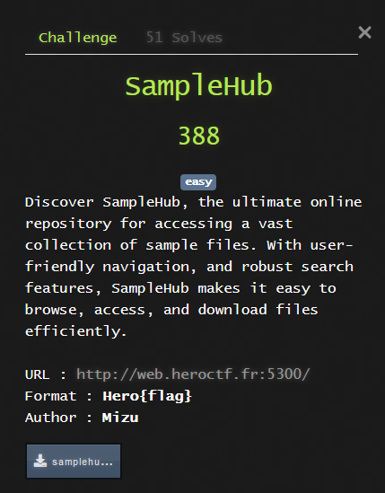
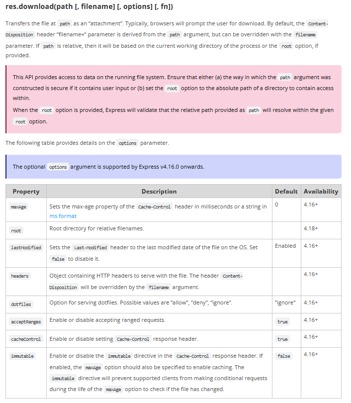

# web - sampleHub




## Overview

**Source :**

```js
const express = require("express");
const path    = require("path");

const app  = express();
const PORT = 3000;

app.use(express.static(path.join(__dirname, "public")));
app.set("view engine", "ejs");
app.set("views", path.join(__dirname, "views"));

app.get("/", (req, res) => {
    res.render("index");
});

process.chdir(path.join(__dirname, "samples"));
app.get("/download/:file", (req, res) => {
    const file = path.basename(req.params.file);
    res.download(file, req.query.filename || "sample.png", (err) => {
        if (err) {
            res.status(404).send(`File "${file}" not found`);
        }
    });
}); 


app.listen(PORT, () => {
    console.log(`Server is running on http://localhost:${PORT}`);
});
```

This web application allows us to download samples of files, for example a sample of a png file with the url `http://web.heroctf.fr:5300/download/sample.png`. The argument `?filename=` can be used to rename the file returned by the server.

To send files, the website goes to the directory where all samples ar located, ensure that the path we give is a filename, to prevent download outside of the sample directory, and uses `download` function of `express` library. If we look at express documenation, we can find about download at https://expressjs.com/en/api.html#res.download.



When looking at the documenation, it's possible to see some interesting arguments under `options`, like `root`, that allows to specify the `Root directory for relative filenames`.

To exploit this, let's dive into nodejs request handling.


## Javascript is ~~normal~~ strange

Imagine that you want to pass an array in a get parameter. Absurd without some special server code, right ? With javascript, it's possible, let's take our `filename` argument for example.

```
?filename=aa&filename=bb
```

will result in 

```js
var filename = ["aa", "bb"]
```

Even wierder, imagine that you want a key-value array, it's also possible.

```
?filename[aa]=bb&filename[cc]=dd
```

will result in

```js
var filename = {"aa": "bb", "cc": "dd"}
```

With all this cursed knowledge, we can now move on the exploit part.

## Exploit

As seen in the documentation, both arguments `filename` and `options` are optional, hence, if we send a key-value array as the second parameter, it'll be considered as the `options` argument.

With that in mind, we can craft a payload to get `app.js`.

```
http://web.heroctf.fr:5300/download/app.js?filename[root]=/usr/app/
```
And it worked. To get the flag, stored in `/.flag.txt`, we need to add an option allowing for dot file download (see download function documentation). This gives us the following url.

```
http://web.heroctf.fr:5300/download/.flag.txt?filename[root]=/&filename[dotfiles]=allow
```

Thanks for the challenge.